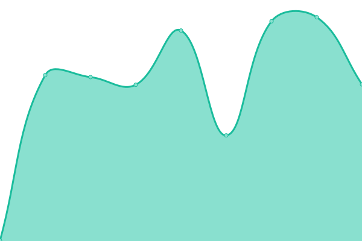
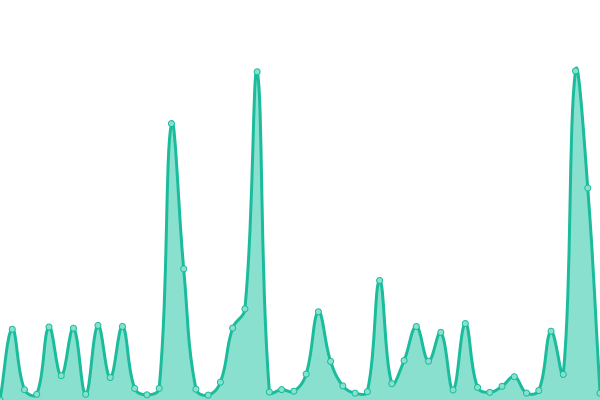

# 📈 Wayback Archiver Status

This repository contains the open-source uptime monitor and status page for [Wayback Archiver](https://wabarc.eu.org), powered by [Upptime](https://github.com/upptime/upptime).

With [Upptime](https://upptime.js.org), you can get your own unlimited and free uptime monitor and status page, powered entirely by a GitHub repository. We use [Issues](https://github.com/wabarc/status/issues) as incident reports, [Actions](https://github.com/wabarc/status/actions) as uptime monitors, and [Pages](https://demo.upptime.js.org) for the status page.

<!--start: status pages-->
<!-- This summary is generated by Upptime (https://github.com/upptime/upptime) -->
<!-- Do not edit this manually, your changes will be overwritten -->
<!-- prettier-ignore -->
| URL | Status | History | Response Time | Uptime |
| --- | ------ | ------- | ------------- | ------ |
|  [Wayback Archiver](https://wabarc.eu.org) | 🟩 Up | [wayback-archiver.yml](https://github.com/wabarc/status/commits/HEAD/history/wayback-archiver.yml) | 

 393ms
     
 | 

<a href="https://wabarcstatus.eu.org/history/wayback-archiver">97.60%</a>
    

|  [Wayback Archiver Documentation](https://initium.eu.org) | 🟩 Up | [wayback-archiver-documentation.yml](https://github.com/wabarc/status/commits/HEAD/history/wayback-archiver-documentation.yml) | 

 404ms
     
 | 

<a href="https://wabarcstatus.eu.org/history/wayback-archiver-documentation">98.09%</a>
    

|  [Wayback Archiver Status](https://wabarcstatus.eu.org) | 🟩 Up | [wayback-archiver-status.yml](https://github.com/wabarc/status/commits/HEAD/history/wayback-archiver-status.yml) | 

 279ms
     
 | 

<a href="https://wabarcstatus.eu.org/history/wayback-archiver-status">100.00%</a>
    

|  [Packages Repository](https://repo.wabarc.eu.org/) | 🟩 Up | [packages-repository.yml](https://github.com/wabarc/status/commits/HEAD/history/packages-repository.yml) | 

 695ms
     
 | 

<a href="https://wabarcstatus.eu.org/history/packages-repository">100.00%</a>
    

<!--end: status pages-->

[**Visit our status website →**](https://wabarcstatus.eu.org/)

## 📄 License

- Powered by: [Upptime](https://github.com/upptime/upptime)
- Code: [MIT](./LICENSE) © [Wayback Archiver](https://wabarc.eu.org)
- Data in the `./history` directory: [Open Database License](https://opendatacommons.org/licenses/odbl/1-0/)
